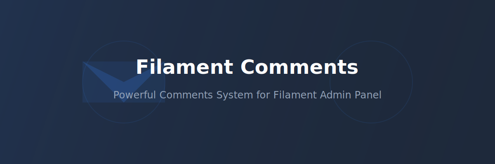

# Filament Comments

<div align="center">
    
</div>

A powerful comments system for Filament admin panel, allowing you to add commenting functionality to your Filament resources.

## Features

- Easy integration with Filament admin panel
- Real-time comments using Livewire
- Activity tracking for comments
- Configurable and customizable
- Supports multiple comment types
- Built-in migrations and configurations

## Requirements

- PHP 8.1+
- Laravel 10.0+
- Filament 3.0+

## Installation

You can install the package via composer:

```bash
composer require xentixar/filament-comments
```

Publish the service provider:

```bash
php artisan vendor:publish --provider="Xentixar\FilamentComment\FilamentCommentServiceProvider"
```

Run the migrations:
```bash
php artisan migrate
```

## Usage

### Adding Comments to Your Models

To enable comments on your model, use the `HasFilamentComment` trait:

```php
use Xentixar\FilamentComment\Models\Traits\HasFilamentComment;

class Post extends Model
{
    use HasFilamentComment;
    
    protected $fillable = ['title', 'content', 'user_id'];
}
```

### Adding Comment Preview to Filament Resources

To add the comment preview functionality to your Filament resource tables, import and use the `CommentPreview` action:

```php
use Xentixar\FilamentComment\Tables\Actions\CommentPreview;

class PostResource extends Resource
{
    public static function table(Table $table): Table
    {
        return $table
            ->columns([
                // Your columns...
            ])
            ->actions([
                Tables\Actions\ViewAction::make(),
                Tables\Actions\EditAction::make(),
                CommentPreview::make() // Add this line
            ]);
    }
}
```

This will add a comment preview action to your resource's table, allowing users to view and manage comments directly from the table view.

### Configuration

You can publish and customize the configuration file:

```bash
php artisan vendor:publish --provider="Xentixar\FilamentComment\FilamentCommentServiceProvider" --tag="config"
```

This will publish the configuration file to `config/filament-comments.php`. Here you can customize various aspects of the comments system:

- Comment model settings
- User model configuration
- Activity tracking options
- UI customization options

## Contributing

Please see [CONTRIBUTING.md](CONTRIBUTING.md) for details.

## License

The MIT License (MIT). Please see [License File](LICENSE) for more information.

## Credits

- [xentixar](https://github.com/xentixar)

